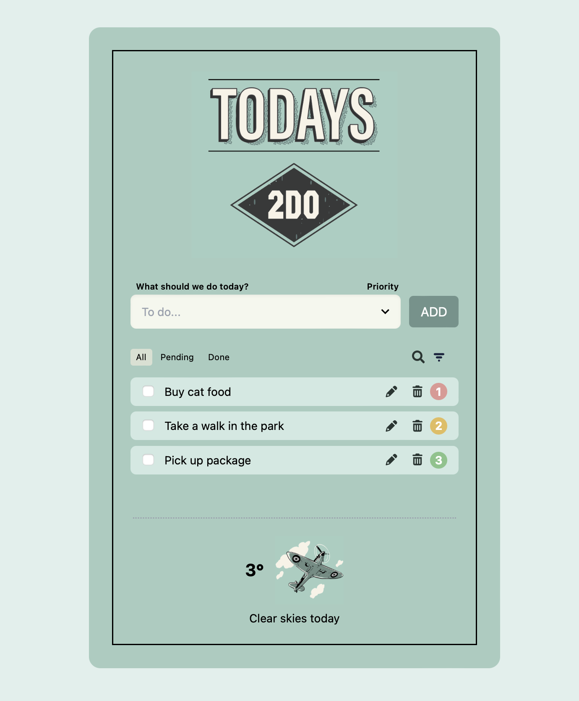

# Today's 2DO - Task Manager

_A retro-styled task management dashboard with weather integration, built with React, TypeScript, Vite, and Tailwind CSS. 
This was a backend school assignment practicing building a complete CRUD task manager with filtering, sorting, and local persistence (and a practical weather indicator) - wrapped in handcrafted sweet 1950s illustrations, colors & typography._

---



---

## ✨ Features

- **Task Management (Full CRUD)**

  - ✅ Add, edit (in-place), delete, and mark tasks as complete/incomplete
  - 🎯 Filter tasks by status (All, Completed, Pending)
  - 🔍 Search tasks by keyword in real-time
  - ⭐ Sort tasks by priority (High → Medium → Low)
  - 💾 Tasks persist across browser sessions with localStorage

- **Weather Integration**

  - 🌤️ Real-time weather using OpenWeatherMap API
  - 📍 Geolocation detection with fallback to default location
  - 🎨 Dynamic weather-based illustrations (sun/rain/default)
  - 💬 Contextual weather messages

- **Design & UX**
  - 🕰️ **1950s retro aesthetic** with period-appropriate colors and typography
  - 📱 Responsive layout
  - ⌨️ Keyboard shortcuts (Enter to add/confirm, Escape to cancel)
  - 🖱️ Double-click to edit tasks
  - ♿ Accessible UI with ARIA labels

---

## 🚀 Tech Stack

- **Frontend**: React 19 + TypeScript
- **Build Tool**: Vite
- **Styling**: Tailwind CSS 4 + custom retro colors
- **Icons**: FontAwesome + React Icons
- **Weather API**: OpenWeatherMap
- **Code Quality**: ESLint + TypeScript strict mode

---

## 📦 Getting Started

### Prerequisites

- Node.js 16+ & npm

### Installation

1. Clone the repository:

   ```bash
   git clone https://github.com/TrooperLooper/ToDoApp.git
   cd ToDoApp
   ```

2. Install dependencies:

   ```bash
   npm install
   ```

3. Set up environment variables:

   ```bash
   # Create .env.local file with your OpenWeatherMap API key
   echo "VITE_WEATHER_API_KEY=your_api_key_here" > .env.local
   ```

4. Start the development server:

   ```bash
   npm run dev
   ```

5. Open http://localhost:5173 in your browser

---

## 💻 Usage

### Managing Tasks

- **Add**: Type task name, select priority, press Enter or click ADD
- **Edit**: Double-click any task to edit inline, or click the edit icon
- **Complete**: Click the checkbox next to a task
- **Delete**: Click the trash icon
- **Filter**: Use the tab buttons (All/Pending/Done)
- **Search**: Click the search icon and type to filter by keyword
- **Sort**: Click the filter icon to sort by priority

### Weather

- The weather widget automatically detects your location (with fallback to Helsingborg, Sweden)
- Shows current temperature and contextual message
- Updates automatically on mount

---

## 🏗️ Project Structure

```
src/
├── components/
│   ├── taskManager.tsx      # Main component with task logic
│   ├── TaskRow.tsx          # Individual task row component
│   ├── weather.tsx          # Weather widget with API integration
│   ├── FilterIcon.tsx       # Sort button icon
│   ├── types.tsx            # TypeScript type definitions
│   └── Header.tsx           # Header component
├── assets/
│   ├── headerimg.png        # 1950s style header
│   ├── weather_sun.png      # Sun weather icon
│   ├── weather_rain.png     # Rain weather icon
│   └── weather_standard.png # Default weather icon
├── App.tsx                  # Root component
├── main.tsx                 # Entry point
└── index.css                # Global styles
```

---

## 🛠️ Available Scripts

```bash
npm run dev       # Start development server
npm run build     # Build for production
npm run lint      # Run ESLint checks
npm run preview   # Preview production build locally
npm run deploy    # Deploy to GitHub Pages
```

---

## 🔐 Environment Variables

This project requires an OpenWeatherMap API key for weather functionality:

```
VITE_WEATHER_API_KEY=your_api_key_here
```

Get your free API key at: https://openweathermap.org/api

**Note**: `.env.local` file is git-ignored for security.

---

## 🎨 Design Highlights

- **1950s Color Palette**: Soft greens, muted pastels, and retro accents
- **Typography**: Clean, readable fonts with period-appropriate sizing
- **Layout**: Centered card design with generous spacing
- **Interactive Elements**: Hover states and smooth transitions
- **Accessibility**: Keyboard navigation and screen reader support

---

## 📚 Key Programming Concepts

- **React Hooks**: useState, useEffect, useRef
- **TypeScript**: Strong typing with interfaces and union types
- **Functional Programming**: map, filter, reduce for task operations
- **Component Composition**: Reusable TaskRow and Weather components
- **State Management**: Local state with localStorage persistence
- **API Integration**: Fetch API with error handling and fallbacks
- **CSS-in-JS**: Tailwind CSS for responsive design

---

## 🧪 Testing

```bash
# Run linter
npm run lint

# Build verification
npm run build
```

---

## 📄 License

MIT

---

## 👥 Credits

**Code & graphic design created by**: Lars Munck

**APIs Used**:

- [OpenWeatherMap API](https://openweathermap.org/)
- [FontAwesome Icons](https://fontawesome.com/)

**Libraries**:

- [React](https://react.dev/)
- [Vite](https://vitejs.dev/)
- [Tailwind CSS](https://tailwindcss.com/)
- [TypeScript](https://www.typescriptlang.org/)
