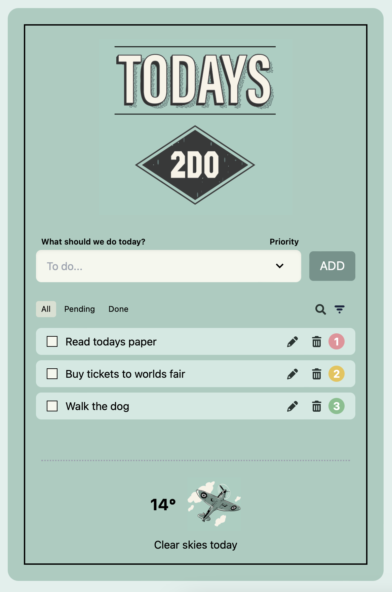

# Today's 2DO App

A stylish task management application with a vintage aesthetic that helps you organize your day while providing helpful weather advice.



## About the Project

Today's 2DO began as a backend school assignment focused on learning TypeScript, ESLint, API integration, and callback functions. Utilizing my designer background and frontend skillset. I enhanced it with a handcrafted design in Adobe Illustrator and added additional features to create a user friendly, functional task management experience.

The app features a nostalgic notebook aesthetic that puts users in a positive mindset while providing accesible organization tools and weather update to help a busy person choosing to bring an umbrella or sunglasses before venturing out in the elements.

## Features

- **Complete Task Management**: Create, read, update, and delete tasks
- **Priority System**: Assign high, medium, or low priority to each task
- **Flexible Filtering**: View all tasks, pending tasks, or completed tasks
- **Quick Search**: Easily find specific tasks as your list grows
- **Priority Sorting**: Organize tasks by importance with one click
- **Weather Integration**: Get helpful weather advice and temperature (celcius) based on your location
- **Responsive Design**: Works well on both desktop and mobile devices

## Technology Stack

- **React**: Component-based UI architecture
- **TypeScript**: Type-safe code for better reliability
- **Tailwind CSS**: Custom styling with utility-first approach
- **OpenWeather API**: Real-time weather data
- **FontAwesome**: Intuitive icon system
- **ESLint**: Code quality and consistency

## User Experience Design

The app is designed around these key principles:

- **Intuitive Organization**: Clean, straightforward task management
- **Weather-Aware**: Helpful tips before venturing out (e.g., "Remember your umbrella today")
- **Vintage Paper Design**: Familiar notebook aesthetic for a calm, organized feeling
- **Responsive Layout**: Adapts well from mobile to desktop
- **Inclusive Design**: Visually pleasing aesthetics that don't sacrifice accessibility, ensuring usability for people with various abilities and preferences
- **Attention to Detail**: Thougtfull interactions, and visual feedback that enhance the experience without creating distractions

## Accessibility Features

Today's 2DO was built with accessibility in mind:

- **Screen Reader Compatible**: Properly labeled interactive elements with ARIA attributes
- **Keyboard Navigation**: Full functionality without requiring mouse interaction
- **Semantic HTML**: Proper heading hierarchy and landmark regions
- **Meaningful Alt Text**: Descriptive alternatives for all images
- **Status Announcements**: Screen reader notifications for task status changes
- **Weather Information**: Accessible weather data with proper descriptions and units

I have attempted to make my visual design align with WCAG 2.1 compliance while providing an pleasant visual experience. This ensures the application remains usable and delightful for users of all abilities.

## Getting Started

### Prerequisites

- Node.js (v14+ recommended)
- npm or yarn

### Installation

1. Clone the repository

   ```
   git clone https://github.com/yourusername/todays-2do.git
   ```

2. Navigate to the project directory

   ```
   cd todays-2do
   ```

3. Install dependencies

   ```
   npm install
   ```

4. Start the development server

   ```
   npm run dev
   ```

5. Open your browser to `http://localhost:3000`

## Future Enhancements

- Task categories and tags
- Cloud synchronization
- Mobile app version using React Native/ React EXPO

## Acknowledgments

- OpenWeather API for weather data
- The React and TypeScript communities for excellent documentation

---
